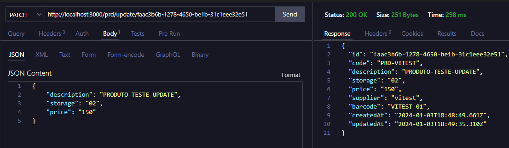

# API - CRUD_Products

## Metodologias Desenvolvimento:
- TDD ( Test Driven Development )
- SOLID
- Clean Architecture

## Bibliotecas / Ferramentas:
#### **Framework**: - ExpressJS
- NodeJS
- Typescript
- Vitest
- DynamoDB - *AWS-SDK*
- Zod
- Dotenv
- Tsx
- Axios

## Validações:
#### Code:
- formato: *string* - ex: 'PRD-VITEST'
- max_length: 20

#### Description:
- formato: *string* - ex: 'PRODUTO-TESTE'
- max_length: 45

#### Storage:
- formato: *string* - ex: '01'
- length: 2

#### Price:
- formato: *string* - ex: '100'
- max_length: 15
- only_numbers

#### Supplier:
- formato: *string* - ex: '000001'
- length: 6

#### Barcode:
- formato: *string* - ex: '000000001'
- length: 9


## Endpoints:

```
Product: {
    id: string
    code: string
    description: string
    storage: string
    price: string
    supplier: string
    barcode: string
    createdAt: string
    updatedAt: string
}
```

### - /prd?id=:id
**@Method**: GET <br>
**@Returns**: Product

 <br>

### - /prd/list
**@Method**: GET <br>
**@Returns**: Product[ ]

 <br>

### - /prd/insert
**@Method**: POST <br>
**@Body**: { <br>
```
   code: string  *required
   description: string  *required
   storage: string  *required
   price: string  *required
   supplier: string  *required
   barcode: string  *required
```
} <br>
**@Returns**: Product

 <br>


### - /prd/update/:id
**@Method**: PATCH <br>
**@Params**: { *id*: `string` } <br>
**@Body**: { <br>
```
   description: string  *optional
   storage: string  *optional
   price: string  *optional
   supplier: string  *optional
   barcode: string  *optional
```
} <br>
**@Returns**: Product




### - /prd/delete/:id
**@Method**: DELETE <br>
**@Params**: { *id*: `string` } <br>
**@Returns**: { deleted_id: string }


## API Info:

### Dados persistidos:
- DB NoSQL: DynamoDB - AWS


### Testes:

#### com E2E:


#### sem E2E *(requisições ao banco de dados mockadas)*:

